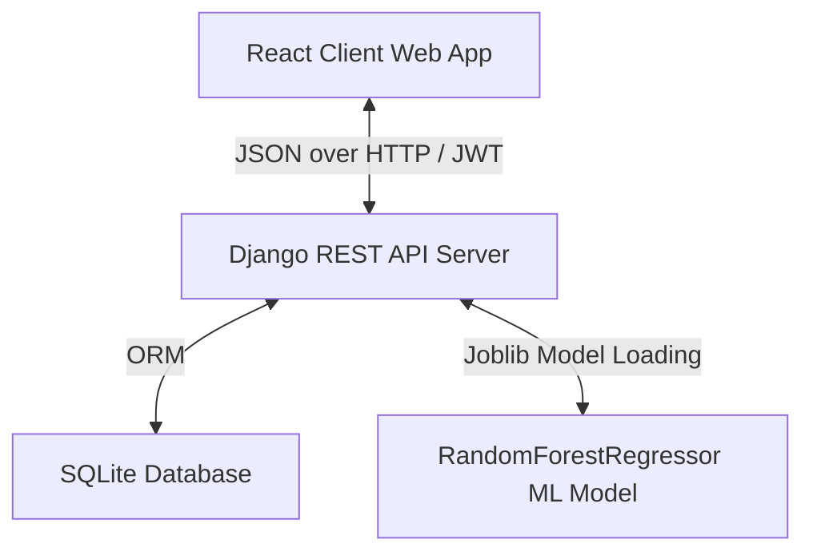
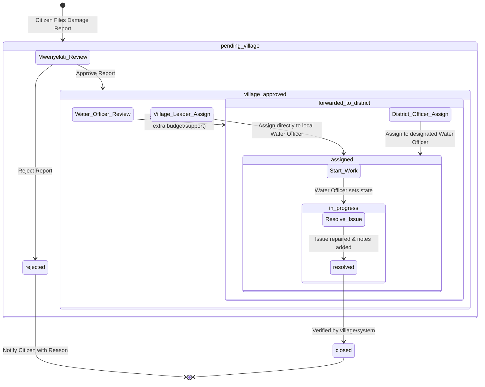
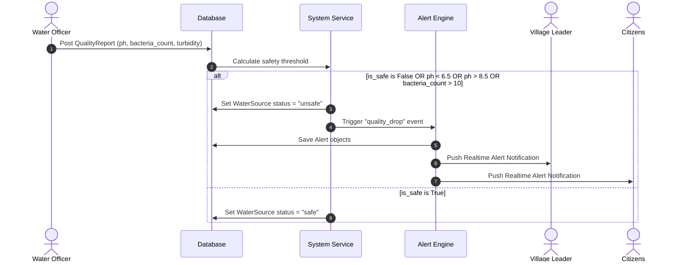
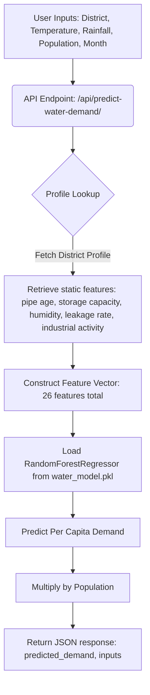

# WaterTrack: Complete Workflow & Functional Requirements Document

Welcome to the official technical and functional specifications document for the **WaterTrack** platform. This platform is designed to manage, monitor, and maintain municipal and rural water supply systems in Tanzania (specifically supporting regions and districts like Dodoma, Arusha, Mwanza, Morogoro, Mbeya, Kigamboni, Kinondoni, Ilala, Temeke, and Ubungo).

---

## 1. System Architecture & Tech Stack

WaterTrack is built using a decoupled client-server architecture:

### 1.1 Backend
- **Core Framework**: Django 4.x
- **API Interface**: Django REST Framework (DRF)
- **Authentication**: JWT-based stateless authentication (`rest_framework_simplejwt`, `dj_rest_auth`)
- **Data Persistence**: SQLite Database (`db.sqlite3` in development/production)
- **Machine Learning Integration**: `joblib` for loading a trained `RandomForestRegressor` (`water_model.pkl`) to predict district-wise water demand dynamically.

### 1.2 Frontend
- **Core Library**: React.js (built with Create React App)
- **Styling**: Tailwind CSS configured with a custom, premium **BMW M-inspired design theme**:
  - Near-black canvas background (`#000000`)
  - Crisp white headlines with medium/light-weight body copy (`#ffffff` and `#bbbbbb`)
  - Sharp boundaries (0px border-radius / `{rounded.none}`)
  - Letter-spaced uppercase labels for action items
  - Minimalistic BMW M tricolor stripes (`#0066b1` light blue $\rightarrow$ `#1c69d4` dark blue $\rightarrow$ `#e22718` red) acting as separator lines or high-visibility dividers.
- **Routing**: `react-router-dom` with role-based routing guards.
- **State Management**: React Context API (`AuthContext`) for maintaining session states.

---

## 2. Database Models & Schema

The following Entity-Relationship schema represents the data models defined in `watertrack_app/models.py`:

### 2.1 User (`User` inherits `AbstractUser`)
Represents registered users, incorporating customized access control through roles.
- **role**: CharField (Choices: `citizen`, `village_leader`, `water_officer`, `district_officer`, `admin`)
- **phone**: CharField (max_length=15, optional)
- **village**: ForeignKey to `Village` (nullable, cascade protection on deletion)

### 2.2 Village (`Village`)
Defines the local administrative units where water sources are located.
- **name**: CharField (max_length=100)
- **district**: CharField (max_length=100)
- **region**: CharField (max_length=100)
- **population**: PositiveIntegerField
- **latitude / longitude**: DecimalField (9 digits, 6 decimal places, optional)

### 2.3 WaterSource (`WaterSource`)
Represents physical water points, wells, rivers, or boreholes.
- **name**: CharField (max_length=200)
- **source_type**: CharField (Choices: `shallow_well`, `deep_well`, `spring`, `river`, `dam`, `borehole`, `rainwater`)
- **status**: CharField (Choices: `safe`, `caution`, `unsafe`, `under_repair`, `dry`)
- **village**: ForeignKey to `Village`
- **latitude / longitude**: DecimalField (9 digits, 6 decimal places)
- **Water quality parameters (last recorded)**: `ph_level`, `bacteria_count`, `iron_level`, `turbidity`
- **Maintenance dates**: `last_cleaned`, `next_cleaning`
- **construction_year**: PositiveIntegerField
- **managed_by**: ForeignKey to `User` (limited to water officers)
- **image**: ImageField (stored in `water_sources/` directory)

### 2.4 DamageReport (`DamageReport`)
Handles tickets reporting damaged infrastructure, leaks, or broken pumps.
- **water_source**: ForeignKey to `WaterSource`
- **reported_by**: ForeignKey to `User` (citizen or officer)
- **report_date**: DateTimeField (auto created)
- **title**: CharField
- **description**: TextField
- **priority**: CharField (Choices: `low`, `medium`, `high`, `critical`)
- **status**: CharField (Choices: `pending_village`, `village_approved`, `forwarded_to_district`, `rejected`, `assigned`, `in_progress`, `resolved`, `closed`, `pending`)
- **latitude / longitude**: DecimalField
- **images**: JSONField (list of image paths)
- **assigned_to**: ForeignKey to `User` (Water Officer)
- **resolved_at**: DateTimeField (optional)
- **resolution_notes**: TextField
- **village_approved_by**: ForeignKey to `User` (Village Leader)
- **village_approved_at**: DateTimeField
- **forwarded_by**: ForeignKey to `User` (Water Officer)
- **forwarded_at**: DateTimeField
- **rejection_reason**: TextField (used when report is rejected)

### 2.5 QualityReport (`QualityReport`)
Historical record of water safety measurements logged during inspections.
- **water_source**: ForeignKey to `WaterSource`
- **tested_by**: ForeignKey to `User`
- **test_date**: DateTimeField
- **ph_level**: DecimalField
- **bacteria_count**: PositiveIntegerField
- **iron_level**: DecimalField
- **turbidity**: DecimalField
- **chlorine_level**: DecimalField
- **is_safe**: BooleanField (calculated)
- **notes**: TextField

### 2.6 Alert (`Alert`)
System-generated alerts pushed to user notification center.
- **water_source**: ForeignKey to `WaterSource` (optional)
- **alert_type**: CharField (Choices: `quality_drop`, `source_dry`, `damage`, `maintenance_due`, `general`)
- **message**: TextField
- **recipients**: ManyToManyField to `User`
- **is_read**: BooleanField
- **created_at**: DateTimeField

### 2.7 Message (`Message`)
Direct communication between stakeholders relating to specific tickets.
- **sender / recipient**: ForeignKey to `User`
- **subject**: CharField
- **body**: TextField
- **related_report**: ForeignKey to `DamageReport` (optional)
- **is_read**: BooleanField
- **created_at**: DateTimeField

---

## 3. User Roles & Permission Matrix

| Feature / Action | Citizen | Village Leader | Water Officer | District Officer | System Admin |
| :--- | :---: | :---: | :---: | :---: | :---: |
| View Water Points | Yes (All) | Yes (All) | Yes (All) | Yes (All) | Yes (All) |
| Report Damage | Yes | Yes | Yes | Yes | Yes |
| Run ML Predictor Chatbot | Yes | Yes | Yes | Yes | Yes |
| Approve / Reject Reports | No | **Yes (Own Village)** | No | No | **Yes (All)** |
| Assign Tasks to Water Officers | No | **Yes (Own Village)** | No | **Yes (All)** | **Yes (All)** |
| Forward Tasks to District | No | No | **Yes (Own Village)** | No | **Yes (All)** |
| Perform Quality Testing | No | No | **Yes** | No | **Yes** |
| Update Status (`in_progress`/`resolved`) | No | **Yes (Own Village)** | **Yes (Assigned)** | No | **Yes (All)** |
| CRUD on Villages/Users | No | No | No | No | **Yes** |
| View ML Model Insights | No | No | No | No | **Yes** |

---

## 4. Key Workflows

### 4.1 Damage Reporting & Repair Lifecycle
This flow governs how damages reported by citizens are validated, assigned, resolved, and monitored.

### 4.2 Quality Inspection & Automatic Alerting Flow
This process details how water testing updates parameters and sends urgent notifications.

### 4.3 Machine Learning Demand Prediction Workflow
Predicts water demand based on multiple environmental and demographic inputs.

---

## 5. API Endpoints Reference

### 5.1 Authentication API
- `POST /api/login/`
  - **Payload**: `{ "username": "email_or_username", "password": "secure_password" }`
  - **Response**: JWT Token pair (`access`, `refresh`) plus User Profile serialized details.
- `POST /api/register/`
  - **Payload**: `{ "username": "...", "email": "...", "password": "...", "first_name": "...", "last_name": "..." }`

### 5.2 Water Sources API
- `GET /api/water-sources/` - List all water sources (public).
- `GET /api/water-sources/nearby/` - Query params: `lat`, `lng`, `radius` (in km) to filter locations in vicinity.
- `POST /api/water-sources/{id}/report_damage/` - Create a damage report directly attached to the water source.

### 5.3 Damage Reports API
- `GET /api/damage-reports/` - Returns filtered querysets based on roles.
- `POST /api/damage-reports/` - Citizen reports damage. Automatically marked as `pending_village`.
- `GET /api/damage-reports/recent/` - Public endpoint returning latest 6 reports.
- `POST /api/damage-reports/{id}/village_approve/` - Approved by Village Leader or Admin. Alerts local Water Officers.
- `POST /api/damage-reports/{id}/village_reject/` - Rejection payload: `{ "reason": "Reason for rejection" }`. Alerts reporter.
- `POST /api/damage-reports/{id}/forward_to_district/` - Escalated by Water Officer to District level. Alerts District Officers.
- `POST /api/damage-reports/{id}/assign/` - Payload: `{ "worker_id": <water_officer_id> }`. Sets status to `assigned` and triggers alert.
- `POST /api/damage-reports/{id}/in_progress/` - Triggered by assigned Water Officer.
- `POST /api/damage-reports/{id}/resolve/` - Payload: `{ "notes": "Resolution description" }`. Marks status as `resolved` and alerts reporter.

### 5.4 Alerts & Messages API
- `GET /api/alerts/` - Lists user-specific notifications.
- `POST /api/messages/` - Create direct message.
- `GET /api/messages/?folder=inbox` - Fetch received inbox messages.
- `GET /api/messages/?folder=sent` - Fetch sent folder messages.

### 5.5 Machine Learning Insights & Predictor API
- `GET /api/model-insights/` - Returns:
  - R² validation score
  - Feature importances array (sorted by weight)
  - Validation metrics (MAE, RMSE, Max Error)
  - Sample predictions array for visualization
- `POST /api/predict-water-demand/` - Payload: `{ "district": "Dodoma", "temperature": 32.5, "rainfall": 10.2, "population": 15000, "month": "Jul" }`. Returns predicted demand.

---

## 6. Frontend Route Mapping

| URL Route | Required Role Guard | Component Page | Primary View Layout / Aesthetic |
| :--- | :--- | :--- | :--- |
| `/` | Public (Unauthenticated) | `Home` | Full-bleed hero banner, M-stripe dividers, Recent Reports grid |
| `/login` | Public (Unauthenticated) | `Login` | Minimalistic container, borderless inputs, white keycaps |
| `/register` | Public (Unauthenticated) | `Register` | Simple signup form layout |
| `/predict` | Public (Unauthenticated) | `ChatbotPredictor` | Chatbot style predictor UI |
| `/source/:id` | Public (Unauthenticated) | `WaterSourceDetail` | Detailed metadata, last tested parameters, recent quality trends |
| `/report` | Public (Unauthenticated) | `ReportDamage` | Public ticket submissions form |
| `/dashboard` | Public (Unauthenticated) | `Dashboard` | Overview dashboard showing basic metrics |
| `/alerts` | Public (Unauthenticated) | `Alerts` | Notification inbox screen |
| `/village-dashboard` | `village_leader` | `VillageDashboard` | Village leader analytics metrics |
| `/village-sources` | `village_leader` | `VillageSources` | Water source list specific to leader's village |
| `/village-reports` | `village_leader` | `VillageReports` | Report management modal triggers, approval forms |
| `/village-assign` | `village_leader` | `AssignTasks` | Assign reports to water officers in the village |
| `/village-users` | `village_leader` | `VillageUsers` | List of local users, including registration forms |
| `/village-settings` | `village_leader` | `VillageSettings` | Settings for customizing village configuration |
| `/water-officer-dashboard`| `water_officer` | `WaterOfficerDashboard` | Task summaries, pending quality inspections list |
| `/water-officer-reports`  | `water_officer` | `WaterOfficerReports` | Tasks assigned to the logged-in water officer |
| `/water-officer-sources`  | `water_officer` | `WaterOfficerSources` | Water sources assigned/under jurisdiction of officer |
| `/district-dashboard` | `district_officer` | `DistrictDashboard` | District statistics |
| `/district-reports` | `district_officer` | `DistrictReports` | District-wide ticket review panel |
| `/district-assign` | `district_officer` | `AssignTasks` | District assignment view |
| `/admin` | `admin` / superuser | `AdminDashboard` | Systems administrator global hub |
| `/admin/model-insights` | `admin` / superuser | `ModelInsights` | ML model performance logs, R², importances charts |

---

## 7. Premium UI/UX Standards (BMW M Aesthetic)

To keep the styling visually stunning and unified, developers must adhere to the styling constraints defined in `DESIGN.md`:

1. **Aesthetic Tone**: Motorsport-engineering precision. Pure black (`#000000`) background floors only. No light-mode alternates.
2. **Typography Contrast**: Confident, capitalized titles (bold, weights 700) set against light, elegant body font sizes (weight 300).
3. **Buttons**: Rectangular 0px border radius (`{rounded.none}`). The primary action button is an outline border container that fills up on hover.
4. **Spacing & Dividers**: Uniform section spacing of 96px (`{spacing.section}`). Vertical grid separations use thin 1px hairline lines (`#3c3c3c`). Occasional M tricolor horizontal rules (4px height) should mark transitions between key panels.
5. **No decorative gradients/shadows**: Allow full-bleed imagery (water sources, regional landscapes) to provide depth instead of drop shadows or synthetic backgrounds.
